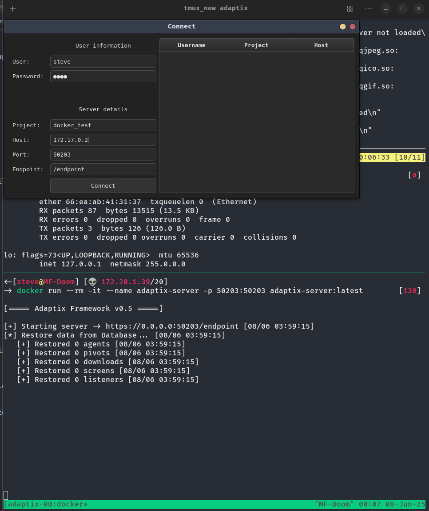
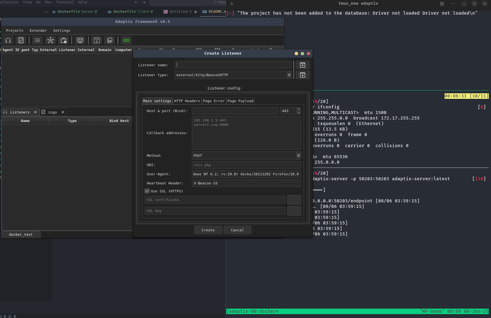
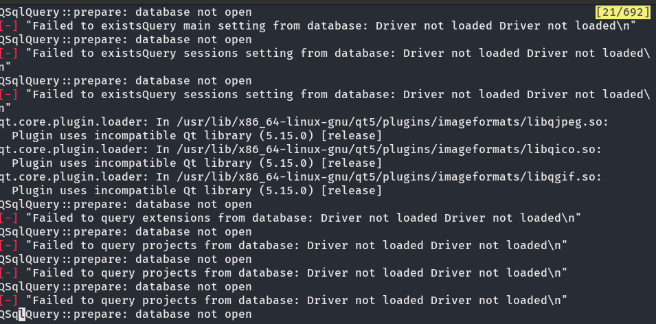

<h1 align="center">
  Adaptix C2 in docker
</h1>

<p align="center">
  <b>Powerful cross-platform C2 infrastructure</b><br>
  Built with Qt, Go, and Docker for a seamless GUI experience and streamlined payload handling.
</p>

---

🚧 Prerequisites
Docker (v20+)

X11 (Linux host, for GUI forwarding)

Qt5-compatible system if running outside Docker

🔧 Setup Instructions

Create Payload Directory
```bash
mkdir payloads
```

This directory will be mounted into the container for access to dropped/generated payloads.

Enable X11 Forwarding (Linux Desktop)
```bash
xhost +local:root
```

This allows the container to render the Qt GUI on your desktop.

Build and Launch the Adaptix Client
```bash
cd Client
docker build -t adaptix-client .
```
```bash
docker run --rm -it \
  -e DISPLAY=$DISPLAY \
  -v /tmp/.X11-unix:/tmp/.X11-unix \
  -v $PWD/payloads:/app/payloads \
  adaptix-client
```

Build and Launch the Adaptix Server
```bash
cd Server

docker build -t adaptix-server .
```

If successful, you’ll see the full GUI interface. Payloads will be saved inside ./payloads.

Launch the Adaptix C2 Server
```bash
docker run --rm -it --name adaptix-server -p 50203:50203 adaptix-server:latest
```

This exposes the C2 server on port 50203.
Retrieve the C2 Server IP (From Another Terminal)

```bash
docker exec -t adaptix-server ifconfig
```

Look for the container’s IP (usually under eth0).

🧪 Example Screenshot
<p align="center">  </p>


🧪 Example Screenshot
<p align="center">  </p>

Payload Directory Usage
Any payloads dropped/generated by the client will be available in ./payloads on the host.

Easily transfer implants, stagers, and logs from within the container.

Development Notes
Built with Go 1.23, Qt 5.x, and CMake 3.31+

Uses X11 forwarding for desktop integration


🧤 Troubleshooting
GUI doesn’t show? → Ensure xhost +local:root was run.

QSQLITE not loaded? → Make sure libqt5sql5-sqlite is installed.

Permission denied on payloads? → Use a bind mount and chmod 777 payloads if needed.

Error Screenshot
<p align="center">  </p>

I'm still investigating the root cause of this issue and will continue refining the implementation.
While I'm not an expert, I'm actively learning and improving as I go.
Feel free to clone, explore, and modify the project as you see fit.